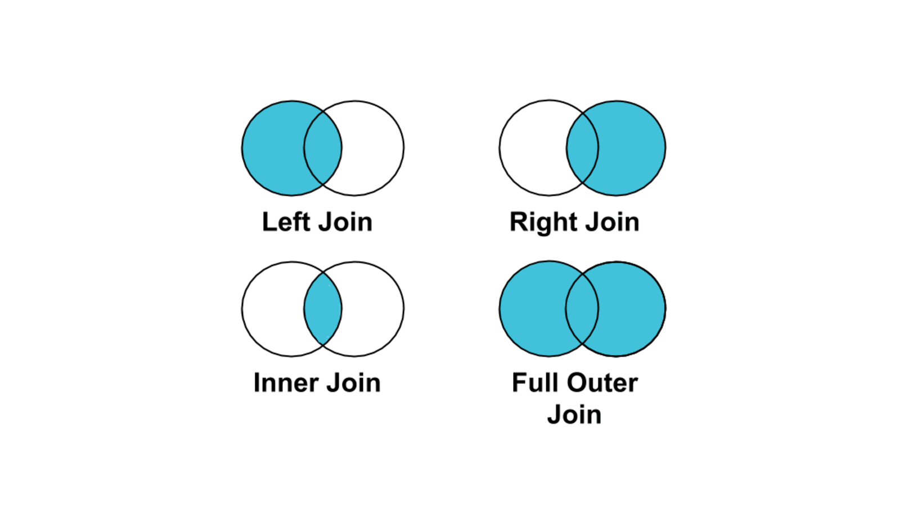

# Unit 1


Basic theory: https://proselyte.net/tutorials/sql/rdbms-basic-concepts/
Db-fiddle: https://www.db-fiddle.com/


## Let's try it simply...

```sql
CREATE TABLE person (
  name varchar(255),
  surname varchar(255),
  phone varchar(255)
);

INSERT INTO person VALUES('John', 'Doe', '111-222-333');
INSERT INTO person VALUES('Jack', 'Black', '123-456-777');
```

Primary key: https://ru.wikipedia.org/wiki/%D0%9F%D0%B5%D1%80%D0%B2%D0%B8%D1%87%D0%BD%D1%8B%D0%B9_%D0%BA%D0%BB%D1%8E%D1%87


## Let's create a data structure

```sql
CREATE TABLE teams (
  id int NOT NULL AUTO_INCREMENT,
  name varchar(255) NOT NULL,
  PRIMARY KEY (id),
  UNIQUE KEY key_team (name)
);

INSERT INTO teams VALUES(1, 'Frontend');
INSERT INTO teams VALUES(2, 'Backend');
INSERT INTO teams VALUES(3, 'Design');
INSERT INTO teams VALUES(4, 'Foo Bar');

SELECT * FROM teams ORDER BY name;
SELECT * FROM teams ORDER BY name ASC;
SELECT * FROM teams ORDER BY name DESC;
SELECT * FROM teams WHERE name='Backend';
SELECT * FROM teams ORDER BY name LIMIT 2 OFFSET 2;

CREATE TABLE members (
  id int NOT NULL AUTO_INCREMENT,
  name varchar(255) NOT NULL,
  team_id int NOT NULL,
  PRIMARY KEY (id),
  CONSTRAINT member_team FOREIGN KEY (team_id) REFERENCES teams (id) ON DELETE CASCADE
);

INSERT INTO members(name, team_id)
  SELECT 'Frontender #1', (SELECT id FROM teams WHERE name='Frontend');
-- INSERT INTO members(name, team_id) VALUES('Frontender #1', 1);
INSERT INTO members(name, team_id)
  SELECT 'Frontender #2', (SELECT id FROM teams WHERE name='Frontend');
INSERT INTO members(name, team_id)
  SELECT 'Backender #1', (SELECT id FROM teams WHERE name='Backend');
INSERT INTO members(name, team_id)
  SELECT 'Backender #2', (SELECT id FROM teams WHERE name='Backend');
INSERT INTO members(name, team_id)
  SELECT 'Backender #3', (SELECT id FROM teams WHERE name='Backend');
INSERT INTO members(name, team_id)
  SELECT 'Designer', (SELECT id FROM teams WHERE name='Design');
```

## Simple queries

```sql
SELECT id, name FROM teams;
SELECT name FROM teams;
SELECT id, name FROM members;
SELECT * FROM members;
SELECT * FROM members WHERE name='Backender #3';
```

## Joins

```sql
SELECT teams.name, members.name FROM teams, members
  WHERE members.team_id=teams.id
    ORDER BY teams.name, members.name;
```

### The issue

```sql
CREATE TABLE poor_teams (
  id int NOT NULL AUTO_INCREMENT,
  team_name varchar(255) NOT NULL,
  member_name varchar(255),
  PRIMARY KEY (id),
  UNIQUE KEY key_team_member (team_name, member_name)
);

INSERT INTO poor_teams(team_name, member_name) VALUES('Frontend', 'Frontender #1');
INSERT INTO poor_teams(team_name, member_name) VALUES('Frontend', 'Frontender #2');
INSERT INTO poor_teams(team_name, member_name) VALUES('Backend', 'Backender #1');
INSERT INTO poor_teams(team_name, member_name) VALUES('Backend', 'Backender #2');
INSERT INTO poor_teams(team_name, member_name) VALUES('Backend', 'Backender #3');
INSERT INTO poor_teams(team_name, member_name) VALUES('Design', 'Designer');
INSERT INTO poor_teams(team_name, member_name) VALUES('Foo Bar', NULL);

SELECT id, team_name, member_name FROM poor_teams
```

[More](https://habr.com/ru/post/254773/) and [more](https://docs.microsoft.com/ru-ru/office/troubleshoot/access/database-normalization-description)...


## Joins




### Inner join. Get teams with related members

```sql
SELECT teams.name, members.name FROM teams
  INNER JOIN members ON members.team_id=teams.id
    ORDER BY teams.name, members.name;
```

|name|name|
|--|--|
|Backend|Backender #1|
|Backend|Backender #2|
|Backend|Backender #3|
|Design|Designer|
|Frontend|Frontender #1|
|Frontend|Frontender #2|

### Left join. Get all teams even without any member.

```sql
SELECT teams.name, members.name FROM teams
  LEFT JOIN members ON members.team_id=teams.id
    ORDER BY teams.name, members.name;
```

|name|name|
|--|--|
|Backend|Backender #1|
|Backend|Backender #2|
|Backend|Backender #3|
|Design|Designer|
|Foo Bar|`null`|
|Frontend|Frontender #1|
|Frontend|Frontender #2|

### Get members count including empty teams.

```sql
SELECT teams.name, COUNT(members.name) FROM teams
  LEFT JOIN members ON members.team_id=teams.id
    GROUP BY teams.name;
```

|name|COUNT(members.name)|
|--|--:|
|Backend|3|
|Design|1|
|Foo Bar|0|
|Frontend|2|

### Version 2 via subquery.

```sql
SELECT teams.name,
       (SELECT COUNT(*) FROM members WHERE members.team_id=teams.id)
  FROM teams ORDER BY teams.name;
```

### Subquery...

```sql
SELECT team_name, member_name FROM (
  SELECT teams.name AS team_name, members.name AS member_name
    FROM teams LEFT JOIN members ON members.team_id=teams.id
      GROUP BY teams.name, members.name
) AS teams_desc;
```

### Aggregated select from a subquery. Don't do it!

```sql
SELECT team_name, COUNT(member_name) FROM (
  SELECT teams.name AS team_name, members.name AS member_name
    FROM teams LEFT JOIN members ON members.team_id=teams.id
      GROUP BY teams.name, members.name
) AS teams_desc GROUP BY team_name;
```

## Unions

```sql
SELECT name FROM teams
UNION
SELECT name FROM members;
```

|name|
|--|
|Backend|
|Design|
|Foo Bar|
|Frontend|
|Frontender #1|
|Frontender #2|
|Backender #1|
|Backender #2|
|Backender #3|
|Designer|
